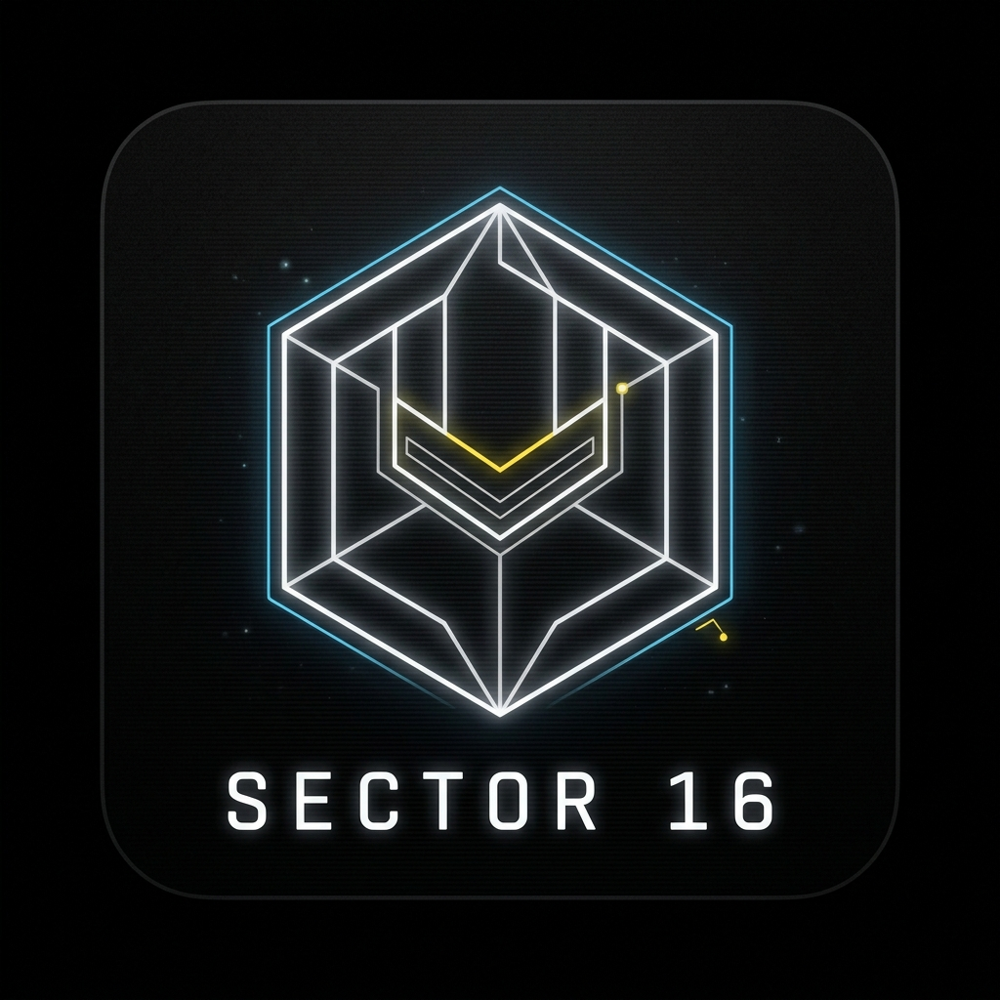
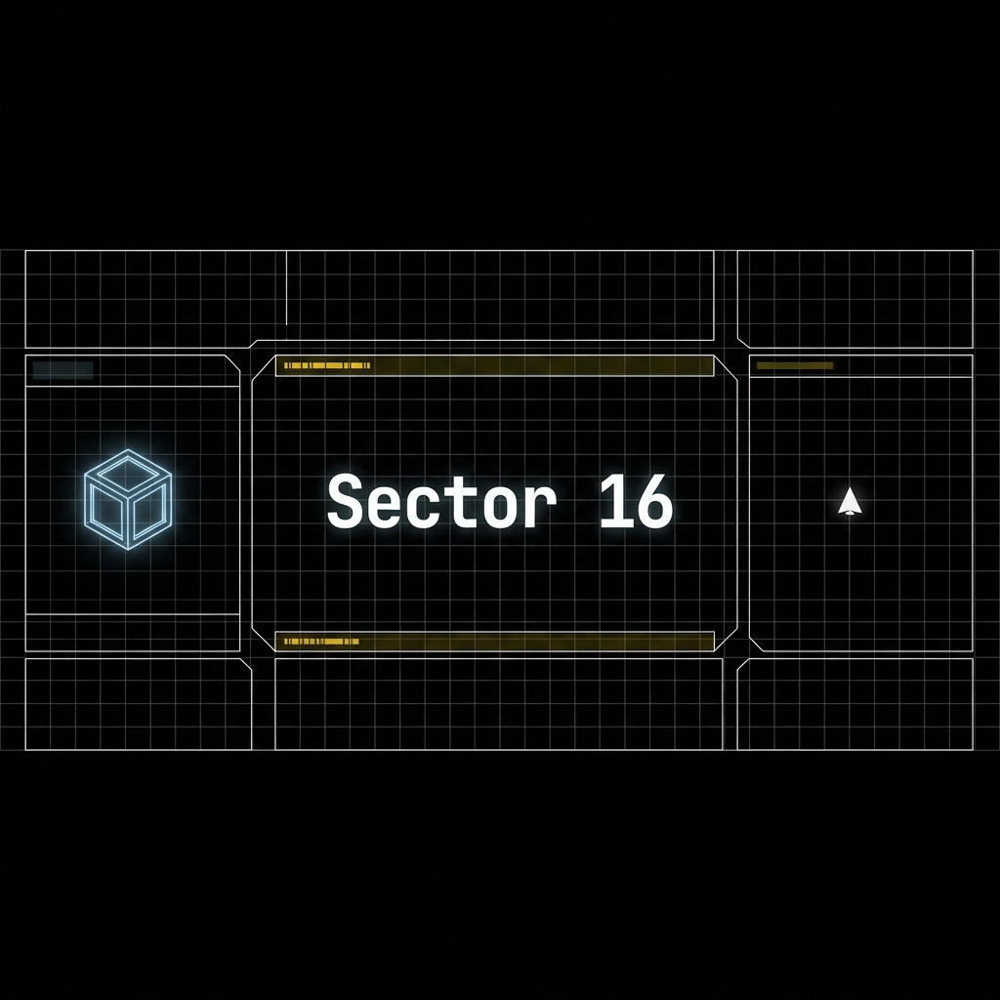

<div align="center">


# Sector 16


</div>

Sector 16 is a web-based, rogue-lite space exploration and trading game built with React, TypeScript, and Vite. Pilot your ship through perilous, procedurally assembled grid-based sectors, scavenging for Nocturnium, battling hostile entities, and upgrading your ship to survive the deep void.

---

## 🌌 The Game

In **Sector 16**, you begin with a basic ship and a small amount of credits. You must navigate a 64x64 global grid consisting of 16 interconnected sectors.

### Core Loop
* **Explore**: Navigate between sectors using your Jump Drive or standard thrusters. Discover Asteroid Belts, Ship Graveyards, Nebulas, and mysterious Ruin Sectors.
* **Scavenge**: Find salvage and mine *Nocturnium*, a rare resource that can be sold for credits.
* **Trade & Upgrade**: Visit Trade Hubs like *Endless Summer Station* or *The Nocturnal Hub* to sell cargo and upgrade your ship's cargo capacity, shields, weapons, and storage.
* **Survive**: Encounter space pirates and ruin guardians. Combat relies on calculated, stat-based volleys where your attack and defense dictate your survival. 

### Key Mechanics
* **Jump Drive & Environmental Hazards**: Nebulas emit radiation that can disable your jump drive. A broken drive leaves you stranded moving tile-by-tile until you reach an Upgrade Center for expensive repairs.
* **Deterministic Randomization**: The world features fixed trade hubs and ruins, but the remaining sectors (Asteroid Belts, The Void, Nebulas) are shuffled every playthrough.
* **Loot & Inventory**: A deep inventory system featuring 64 unique 32-bit retro pixel art icons. Uncover legendary, one-of-a-kind items scattered across the cosmos.
* **The Wizard**: Find the elusive Wizard hidden in the Nebula to complete quests and earn limited-use cloaking spells to bypass radiation and ambushes.
* **Permadeath-lite**: Defeat doesn't end the game entirely, but heavily punishes you by destroying your upgrades, wiping your credits to 10%, and dropping you back at a Trade Hub to rebuild.

---

## 🏗️ Development & Thought Process

Sector 16 was built iteratively through collaborative AI pair-programming, focusing on creating a modular, scalable architecture using modern web technologies (**React 19, TypeScript, TailwindCSS, Vite**).

### Technical Decisions
* **State Management**: The entire game state (inventory, map, ship stats, encounters) is managed through a cohesive React context/hook architecture, allowing for deterministic saves and state persistence.
* **Grid-Based Movement**: Movement and jumping mechanics are mathematically bound to a coordinate system `(0..63, 0..63)`, ensuring spatial consistency for map rendering and distance-based jump calculations.
* **Decoupled Systems**: Combat, trading, jumping, and map generation are isolated into distinct hooks (e.g., `useCombat`, `useJump`, `useMap`), ensuring that adding a new mechanic (like the Nebula's jump-drive-disabling radiation) doesn't break unrelated systems.

### Iterative Design
Based on our ongoing development conversations, the game evolved from a simple prototype into a strategic rogue-lite:
* **Combat Refinements**: We moved away from pure RNG to a deterministic "advantage" system where upgrading weapons and shields directly influences hit chance and critical hit rates. We also added an "Overcharge" mechanic and fixed edge cases regarding combat disengagement.
* **Meaningful Progression**: Instead of simply buying numbers, we introduced specific components (like the Jump Drive upgrade) as progression bottlenecks that require scavenging or saving up credits, grounding the early-game pacing.
* **Mobile First Optimization**: The UI was iteratively optimized to ensure that desktop keyboard shortcuts (like `I` for Inventory, or `1, 2, 3` for combat options) are gracefully hidden on mobile devices, relying instead on a clean touch-friendly interface and D-Pad controls.

---

## 🚀 Future Plans (The Roadmap)

While Sector 16 is fully playable, there are numerous concepts and ideas currently in the design phase. *These may or may not be implemented in the future:*

* **Dynamic Ship-to-Ship Trading**: Moving beyond static Trade Hubs to dynamic encounters with NPC ships. This includes a "Power Dynamic" leverage system where you can intimidate weaker merchants for better deals, and a "Scale Barter" system for exchanging items directly instead of just credits.
* **Deep Loot Integration**: Transforming useless "junk" items into game-changing artifacts with active effects. Examples being explored:
    * *Neon Medusa Core*: An unstable core that buffs flee chances but slowly drains Nocturnium.
    * *Sovereign Admiral's Log*: Unlocking a hidden, high-level "Fallen Fleet" sector on the map.
    * *Experimental Warp Drive*: Allowing players to skip map depths at the risk of triggering hostile ambushes.
* **Cross-Device State Syncing**: Exploring architectural options for implementing a state-syncing mechanism (cloud-based or local peer-to-peer) so players can seamlessly switch between desktop and mobile.
* **Controller Support Improvements**: Further refining the D-Pad and mobile inputs, including adding "long press" interactions for complex commands.

---

## 🛠️ Run Locally

**Prerequisites:** Node.js (v18+)

1. Clone the repository and navigate to the project directory:
2. Install dependencies:
   ```bash
   npm install
   ```
3. Start the development server:
   ```bash
   npm run dev
   ```
4. Build for production:
   ```bash
   npm run build
   ```

---

## License

Open Source. Feel free to fork, modify, and explore Sector 16!
